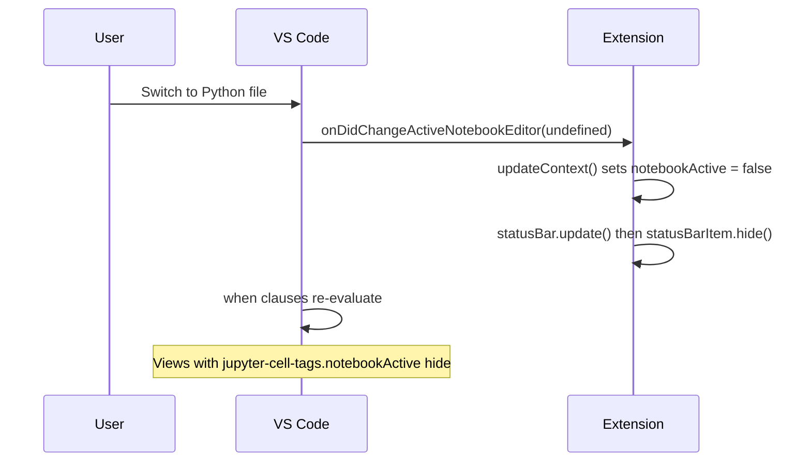

# Hide extension views and status bar when not in notebook context

## Problem

- The **status bar item** (heart + document icon showing selected cells / "") stays visible and shows outdated text when the user switches from a notebook to a non-notebook editor (e.g. a Python file).
- Extension-provided **sidebar views** (All Notebook Tags, Jumpbacks, Custom NB Outline) can remain visible when no notebook is active, showing stale or irrelevant content.

## Root cause

1. **Status bar** (`[src/statusBar.ts](src/statusBar.ts)`): The item is shown once in the constructor (`this.statusBarItem.show()`) and never hidden. `update()` runs on `onDidChangeActiveNotebookEditor` and `onDidChangeNotebookEditorSelection`, so when switching to a Python file it correctly sets text to "" but the item stays visible.
2. **Views** (`[package.json](package.json)` `contributes.views`): Visibility uses `when` clauses that do not require "active editor is a notebook":
  - `all-notebook-tags-view`: only `jupyter:showAllTagsExplorer` (set to `true` in code and never cleared).
  - `jumpbacks`: only `config.jupyter-cell-tags.enableJumpbacks`.
  - `custom-notebook-outline`: `config.jupyter-cell-tags.customOutline.enabled && jupyter.hasNativeNotebookOrInteractiveWindowOpen` (Jupyter extension context may not reflect focus or may be absent).

## Approach

- **Status bar**: Call `hide()` when there is no active notebook editor and `show()` when there is one, inside the existing `update()` path (no new listeners).
- **Views**: Introduce an extension-owned context key `jupyter-cell-tags.notebookActive` set from the existing `updateContext()` in `[src/extension.ts](src/extension.ts)` (which already runs on `onDidChangeActiveNotebookEditor` and `onDidChangeNotebookEditorSelection`). Use this key in each view’s `when` clause so views only appear when a notebook is the active editor.

## Implementation

### 1. Status bar: hide when no notebook, show when notebook

**File:** `[src/statusBar.ts](src/statusBar.ts)`

- In `update()`:
  - If `!vscode.window.activeNotebookEditor`: call `this.statusBarItem.hide()` and return (optionally still update text for when it is shown again).
  - If there is an active notebook editor: set text/tooltip as today, then call `this.statusBarItem.show()`.

This uses the existing listeners; when the user switches to a Python file, `onDidChangeActiveNotebookEditor` runs with the new active notebook editor (undefined), `update()` runs, and the item is hidden.

### 2. Context key for “notebook is active editor”

**File:** `[src/extension.ts](src/extension.ts)`

- In `updateContext()`:
  - Set `jupyter-cell-tags.notebookActive` to `!!editor` (i.e. `true` when `vscode.window.activeNotebookEditor` is set, `false` when not).
  - Keep existing context updates (`singleCellSelected`, `multipleCellsSelected`, `hasJumpback`) as they are.

No new event subscriptions: `updateContext()` already runs on active notebook editor and selection changes and on activation.

### 3. View visibility: require notebook active

**File:** `[package.json](package.json)` – `contributes.views.explorer` (and any other places these view ids are contributed)

- **all-notebook-tags-view**  
  - Current: `"when": "jupyter:showAllTagsExplorer"`  
  - New: `"when": "jupyter:showAllTagsExplorer && jupyter-cell-tags.notebookActive"`  
  So the view hides when the active editor is not a notebook, even if the explorer flag is on.
- **jumpbacks**  
  - Current: `"when": "config.jupyter-cell-tags.enableJumpbacks"`  
  - New: `"when": "config.jupyter-cell-tags.enableJumpbacks && jupyter-cell-tags.notebookActive"`  
  So the view hides when no notebook is active.
- **custom-notebook-outline**  
  - Current: `"when": "config.jupyter-cell-tags.customOutline.enabled && jupyter.hasNativeNotebookOrInteractiveWindowOpen"`  
  - New: `"when": "config.jupyter-cell-tags.customOutline.enabled && jupyter-cell-tags.notebookActive"`  
  This makes visibility depend on our extension’s notion of “notebook is active” instead of the Jupyter extension’s context, so the outline hides when the user switches to a Python file even if Jupyter’s context lags or is missing.

Optional: if the “cell-tag” view under `jupyter-variables` should also hide when not in a notebook, add `&& jupyter-cell-tags.notebookActive` to its existing `when` clause.

## Flow summary

## Files to change

| File                                   | Change                                                                                                                                                              |
| -------------------------------------- | ------------------------------------------------------------------------------------------------------------------------------------------------------------------- |
| `[src/statusBar.ts](src/statusBar.ts)` | In `update()`, call `hide()` when no active notebook editor, `show()` when there is one.                                                                            |
| `[src/extension.ts](src/extension.ts)` | In `updateContext()`, add `setContext('jupyter-cell-tags.notebookActive', !!editor)`.                                                                               |
| `[package.json](package.json)`         | Add `&& jupyter-cell-tags.notebookActive` to the `when` clause for `all-notebook-tags-view`, `jumpbacks`, and `custom-notebook-outline`; optionally for `cell-tag`. |

## Testing

- Open a Jupyter notebook: status bar and notebook-related views (All Notebook Tags, Custom NB Outline, and Jumpbacks if enabled) should be visible.
- Switch to a Python (or any non-notebook) file: status bar item should disappear; those views should disappear or collapse from the Explorer.
- Switch back to the notebook: status bar and views should reappear with correct content.

