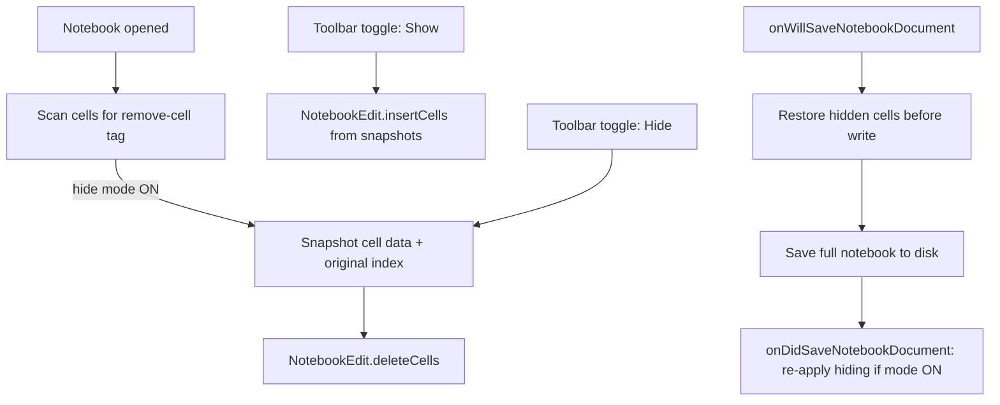

# Remove-Cell Tag Hiding + Toolbar Toggle

## Goal

Cells tagged `remove-cell` (standard Jupyter Book / nbconvert convention) are **hidden from the notebook editor by default**. A button on the **top notebook toolbar** (`notebook/toolbar`) toggles visibility so authors can reveal them for editing.

## Constraint

VS Code exposes **no public API** to hide notebook cells in-place (only collapse input/output, decorations, or delete). The extension already uses `NotebookEdit.deleteCells` / `insertCells` elsewhere ([`src/customOutline/startup.ts`](src/customOutline/startup.ts), [`src/jupyterEnhancements/extension.ts`](src/jupyterEnhancements/extension.ts)). This feature will use **temporary removal from the open document** plus **save-roundtrip restoration** so tagged cells remain in the saved `.ipynb`.



## Approach

### 1. New module: `src/removeCell/`

| File | Responsibility |
|---|---|
| [`src/removeCell/constants.ts`](src/removeCell/constants.ts) | `REMOVE_CELL_TAG = 'remove-cell'` |
| [`src/removeCell/cellSnapshot.ts`](src/removeCell/cellSnapshot.ts) | `toCellData(cell)` / `toSnapshot(cell)` using `NotebookCellData` (kind, value, languageId, metadata, outputs, executionSummary) |
| [`src/removeCell/RemoveCellHidingManager.ts`](src/removeCell/RemoveCellHidingManager.ts) | Core state + apply/restore logic |
| [`src/removeCell/startup.ts`](src/removeCell/startup.ts) | Register command, listeners, context keys |

**Tag detection** — reuse [`getCellTags()`](src/helper.ts):

```typescript
getCellTags(cell).includes(REMOVE_CELL_TAG)
```

**Per-notebook state** (keyed by `notebook.uri.toString()`):

- `snapshots: { originalIndex: number; data: NotebookCellData }[]`
- `applied: boolean` — cells currently removed from the open document
- `isApplying: boolean` — guard to ignore our own `onDidChangeNotebookDocument` events

**Apply hiding** (`applyHiding(notebook)`):

1. If already applied or no tagged cells, return.
2. Collect tagged cells with current indices; sort **descending** by index.
3. Snapshot each cell, then `NotebookEdit.deleteCells` in one `WorkspaceEdit`.
4. Set `applied = true`, update context key.

**Restore** (`restoreHiddenCells(notebook)`):

1. Insert snapshots **ascending** by `originalIndex` via `NotebookEdit.insertCells`.
2. Clear `applied`, clear snapshots for that notebook.

**Toggle command** `jupyter-cell-tags.removeCell.toggleVisibility`:

- Global hide mode stored in `ExtensionContext.globalState` (`removeCell.hideEnabled`, default **`true`** per your preference).
- When turning **on**: `applyHiding` on active notebook (and any tracked open notebooks).
- When turning **off**: `restoreHiddenCells`.
- Update toolbar context: `jupyter-cell-tags.removeCell.hideEnabled`.

**Save safety** (critical):

```typescript
workspace.onWillSaveNotebookDocument(e => {
  if (manager.isApplied(e.notebook)) {
    e.waitUntil(manager.restoreHiddenCells(e.notebook));
  }
});
workspace.onDidSaveNotebookDocument(notebook => {
  if (manager.shouldRehide(notebook)) {
    manager.applyHiding(notebook);
  }
});
```

**Lifecycle listeners** (debounced ~150ms, matching other modules):

- `onDidOpenNotebookDocument` — apply hiding if mode ON
- `onDidChangeActiveNotebookEditor` — sync toolbar context (e.g. count of hidden cells)
- `onDidChangeNotebookDocument` — when mode ON and not `isApplying`: if a visible cell gains `remove-cell`, hide it; reconcile after external undo

**Deactivate** — restore all notebooks with applied hiding before disposal.

### 2. Wire activation

In [`src/extension.ts`](src/extension.ts): import and call `activateRemoveCellHiding(context)` alongside existing modules.

### 3. `package.json` contributions

**Command**

- `jupyter-cell-tags.removeCell.toggleVisibility`
- Title: `Toggle Remove-Cell Visibility`
- Icon: `$(eye-closed)` when hidden (click to show), `$(eye)` when shown — implement via **two menu entries** with complementary `when` clauses on context `jupyter-cell-tags.removeCell.hideEnabled`, or update icon/title in the command handler via `vscode.commands.executeCommand` pattern used elsewhere.

**Toolbar** — add to [`package.json`](package.json) `notebook/toolbar` (group `navigation/execute@9`):

```json
{
  "command": "jupyter-cell-tags.removeCell.toggleVisibility",
  "group": "navigation/execute@9",
  "when": "notebookType == jupyter-notebook"
}
```

**Setting** (optional, small scope):

- `jupyter-cell-tags.removeCell.enabled` (default `true`) — master switch to disable the feature

**Activation events**: `onCommand:jupyter-cell-tags.removeCell.toggleVisibility`

**Context keys** set at runtime:

- `jupyter-cell-tags.removeCell.hideEnabled` — drives toggle icon/state
- `jupyter-cell-tags.removeCell.hasHiddenCells` — optional `when` to dim button when notebook has no tagged cells

### 4. Edge cases

| Case | Handling |
|---|---|
| Save while hidden | Restore before save, re-hide after (cells persist on disk) |
| Close without save | VS Code reverts to disk copy; snapshots discarded |
| Undo after hide | Reconcile on `onDidChangeNotebookDocument` |
| Tagged cell added while hidden | Debounced re-scan → snapshot + delete |
| Run All / run groups | Hidden cells absent from model → naturally skipped (nbconvert parity) |
| Git diff / outline / tree views | Indices shift while hidden — acceptable; document limitation |
| Non-`jupyter-notebook` types | Only register for `jupyter-notebook` |

### 5. Manual test checklist

- Tag a cell `remove-cell` in [`examples/notebooks/Simple_TestNB.ipynb`](examples/notebooks/Simple_TestNB.ipynb); confirm it disappears on open/reload
- Toolbar toggle reveals all tagged cells for editing
- Toggle again hides them
- Save notebook → reopen → tagged cells still present in raw JSON
- Run All skips hidden cells
- Add `remove-cell` to a visible cell while hide mode ON → cell disappears
- Undo restore after hide reconciles correctly

## Out of scope

- `hide-cell`, `remove-input`, `remove-output` (only `remove-cell` for now)
- Export/nbconvert integration
- Per-notebook hide preference (global toggle only)
- Changing git-diff or outline providers to account for shifted indices

## Key files to change

- **New:** `src/removeCell/*` (4 files)
- **Edit:** [`src/extension.ts`](src/extension.ts), [`package.json`](package.json)
