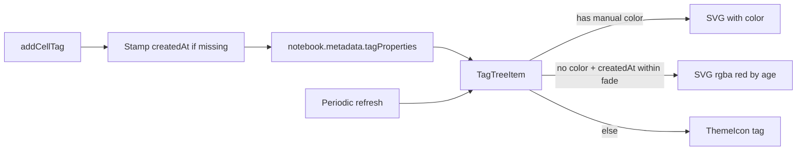

# Tag creation-date hot coloring (tree view)

## Decisions (locked)

- **Manual color wins**: age-based hot color applies only when `TagProperties.color` is unset.
- **Fade window**: 1 month (configurable setting, default **30 days**).
- **Legacy tags**: no `createdAt` → stay fully clear (default `ThemeIcon('tag')`); do not backfill on open.
- **Scope**: All Notebook Tags tree icons only (not scrollbar / status bar).

## Approach



### 1. Persist creation time

Extend [`src/models/tagProperties.ts`](src/models/tagProperties.ts):

```typescript
createdAt?: string; // ISO 8601
```

In [`src/cellTags/cellTags.ts`](src/cellTags/cellTags.ts) `addCellTag`, after collecting `newTags`, for each new tag name that has **no** existing `createdAt` in notebook `tagProperties`, call `TagPropertiesManager.setTagProperties` with `{ ...existing, createdAt: new Date().toISOString() }`.

This covers add-tag commands, multi-cell add, and execution-tracking tags (all go through `addCellTag`). Rename already copies properties, so `createdAt` is preserved.

Add a small helper on [`TagPropertiesManager`](src/tagProperties/tagPropertiesManager.ts), e.g. `ensureCreatedAt(notebook, tagName)`, to keep stamp logic in one place.

### 2. Age → color helper

Add [`src/noteAllTags/tagHotColor.ts`](src/noteAllTags/tagHotColor.ts):

- Read fade days from `jupyter-cell-tags.tagHotColor.fadeDays` (default `30`).
- `getHotIconColor(createdAt: string, now = Date.now()): string | undefined`
  - If age ≥ fade window or invalid date → `undefined` (clear).
  - Else linear fade: opacity `t = 1 - age/fadeMs` from hot red `#e74c3c` → transparent via `rgba(231, 76, 60, t)`.
- Export `DEFAULT_HOT_RGB` / fade ms helpers for tests if useful.

### 3. Wire into tree items

Update [`src/noteAllTags/TagTreeItem.ts`](src/noteAllTags/TagTreeItem.ts) icon selection:

1. If `properties.color` → existing SVG (unchanged).
2. Else if `getHotIconColor(properties.createdAt)` → SVG with that rgba.
3. Else → `ThemeIcon('tag')`.

Tooltip: when `createdAt` is present, add a line like `Created: <locale date>` (and optionally relative age). Do **not** put hot rgba into the description string (avoids noisy UI); keep description for priority / manual color only.

### 4. Cool over time

In [`src/noteAllTags/allNotebookTagsTreeDataProvider.ts`](src/noteAllTags/allNotebookTagsTreeDataProvider.ts) registration (`activate` / `createTreeView` setup):

- Start a disposable `setInterval` (~15 minutes) that calls `treeDataProvider.refresh()` so icons cool without requiring a notebook edit.
- Also refresh when the fade-days setting changes (`onDidChangeConfiguration` for `jupyter-cell-tags.tagHotColor`).

### 5. Setting

In [`package.json`](package.json) under `contributes.configuration`:

- `jupyter-cell-tags.tagHotColor.fadeDays` — number, default `30`, minimum `1`, description: days until a newly created tag fades from hot red to the default icon (only when no manual color is set).

## Key files

- **Edit:** [`src/models/tagProperties.ts`](src/models/tagProperties.ts), [`src/tagProperties/tagPropertiesManager.ts`](src/tagProperties/tagPropertiesManager.ts), [`src/cellTags/cellTags.ts`](src/cellTags/cellTags.ts), [`src/noteAllTags/TagTreeItem.ts`](src/noteAllTags/TagTreeItem.ts), [`src/noteAllTags/allNotebookTagsTreeDataProvider.ts`](src/noteAllTags/allNotebookTagsTreeDataProvider.ts), [`package.json`](package.json)
- **New:** [`src/noteAllTags/tagHotColor.ts`](src/noteAllTags/tagHotColor.ts)

## Manual test

- Add a new tag → tree icon is hot red; no manual color set.
- Set a manual color on that tag → icon uses manual color.
- Clear manual color → hot color returns (if still within fade window).
- Tag with no `createdAt` in metadata → default tag icon.
- Wait / temporarily set `fadeDays` to `1` and mock/old `createdAt` → icon is clear.